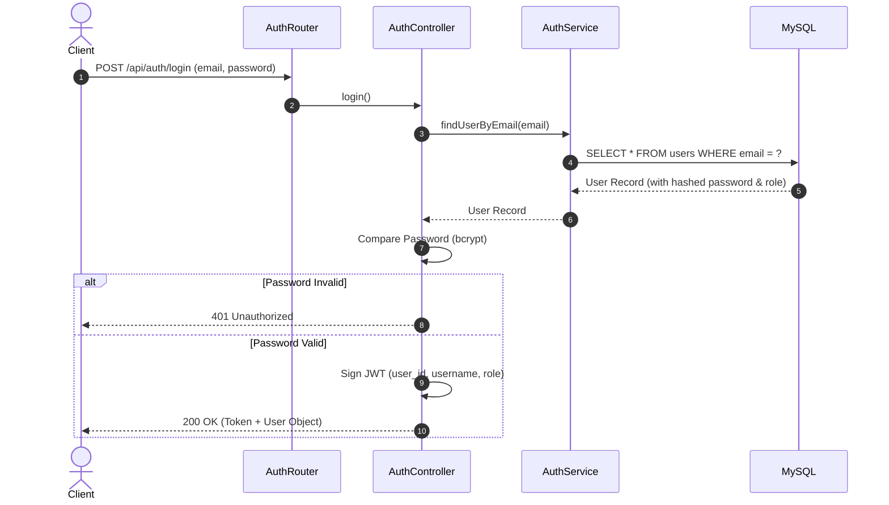
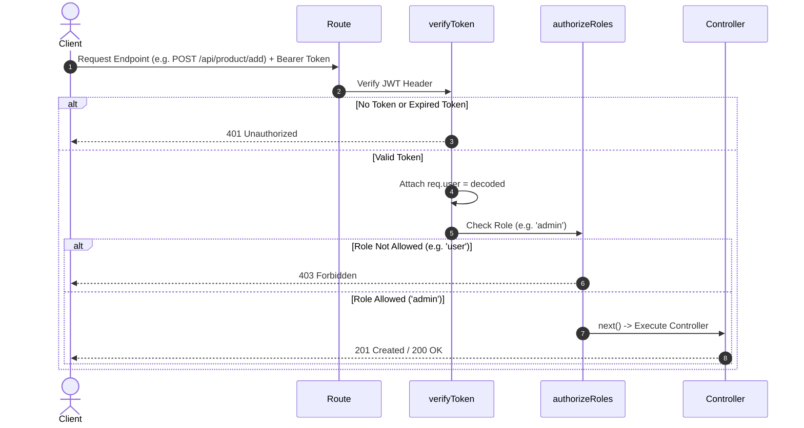
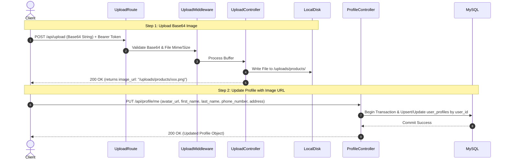

# 🏗️ Web API Express - System Flow & Production Readiness Guide

เอกสารวิเคราะห์ลำดับการทำงานของระบบ (System Flow), สถาปัตยกรรมปัจจุบัน (Current Architecture) และข้อเสนอแนะสำหรับการปรับปรุงระบบให้พร้อมใช้งานจริงระดับอุตสาหกรรม (**Production Ready**)

---

## 📑 สารบัญ
1. [ภาพรวมสถาปัตยกรรมระบบปัจจุบัน (Current System Architecture)](#1-ภาพรวมสถาปัตยกรรมระบบปัจจุบัน-current-system-architecture)
2. [ลำดับการทำงานของระบบ (System Flow Diagram)](#2-ลำดับการทำงานของระบบ-system-flow-diagram)
3. [วิเคราะห์ความพร้อมระดับ Production (Production Readiness Gap Analysis)](#3-วิเคราะห์ความพร้อมระดับ-production-production-readiness-gap-analysis)
4. [ฟีเจอร์และส่วนประกอบที่ควรเพิ่ม (Recommended Missing Components)](#4-ฟีเจอร์และส่วนประกอบที่ควรเพิ่ม-recommended-missing-components)
5. [แผนการปรับปรุงระบบสู่ Production (Roadmap to Production)](#5-แผนการปรับปรุงระบบสู่-production-roadmap-to-production)

---

## 1. ภาพรวมสถาปัตยกรรมระบบปัจจุบัน (Current System Architecture)

ปัจจุบันระบบพัฒนาด้วย **Express.js (Node.js)** ร่วมกับ **MySQL Connection Pool** โดยใช้สถาปัตยกรรมแบบ **MVC Layered Architecture**:

```
[ Client: Expo RN / Web ]
           │ (HTTP Requests with JWT Bearer Token)
           ▼
[ Express Router Layer ] ──> [ Auth & Role Middleware ]
           │
           ▼
[ Controller Layer ] ──> Validation & HTTP Response
           │
           ▼
[ Service Layer ] ──> Business Logic & Transaction Management
           │
           ▼
[ MySQL Database Pool ] (Sequential ID Generation with FOR UPDATE Lock)
```

---

## 2. ลำดับการทำงานของระบบ (System Flow Diagram)

### 2.1 Flow การสมัครสมาชิก & เข้าสู่ระบบ (Authentication Flow)



---

### 2.2 Flow การตรวจสอบสิทธิ์การเข้าถึง (Protected Route & RBAC Flow)



---

### 2.3 Flow การอัปโหลดรูปภาพโปรไฟล์/สินค้า (Image Upload & Profile Flow)



---

## 3. วิเคราะห์ความพร้อมระดับ Production (Production Readiness Gap Analysis)

| หัวข้อ (Category) | สถานะปัจจุบัน (Current Status) | ความเสี่ยง / จุดที่ต้องปรับปรุง (Gap Analysis) | ความจำเป็นระดับ Production |
| :--- | :--- | :--- | :---: |
| **Security & Rate Limiting** | ⚠️ ไม่มี Rate Limiter | เสี่ยงต่อการโดน Brute Force Login และ Spam Upload จนดิสก์เต็ม | 🔴 **CRITICAL** |
| **File Storage Strategy** | ⚠️ Local Disk (`/uploads`) | หาก Deploy บน Cloud/Container (Docker, K8s, Render, Vercel) รูปจะหายทุกครั้งที่ Restart | 🔴 **CRITICAL** |
| **Input Validation** | ⚠️ Manual Validation (`if (!email)`) | โค้ดซ้ำซ้อนและอาจหลุดการเช็คความสะอาดข้อมูล (XSS / SQL Injection Payload) | 🟡 **HIGH** |
| **Error Handling & Logs** | ⚠️ `try-catch` รายฟังก์ชัน + `console.error` | ไม่มีการเก็บ Centralized Log และไม่แจ้งเตือนเมื่อเกิด Server Crash บน Production | 🟡 **HIGH** |
| **E-Commerce Core Logic** | ⚠️ มีเฉพาะ Product/Category/Profile | ยังไม่มีระบบ Cart, Checkout, Order, Stock Deduction และ Payment Gateway | 🔴 **CRITICAL** |
| **Token Management** | ⚠️ Single Access Token (1 วัน) | หาก Token หลุดลอย จะไม่สามารถ Revoke (Blacklist) หรือสั่ง Logout จากฝั่ง Server ได้ | 🟡 **HIGH** |

---

## 4. ฟีเจอร์และส่วนประกอบที่ควรเพิ่ม (Recommended Missing Components)

### 🛡️ 4.1 ระบบความปลอดภัย (Security & Infrastructure Enhancements)

1. **Rate Limiting Middleware (`express-rate-limit`):**
   - จำกัดจำนวน Request ป้องกัน Brute Force:
     - Login Rate Limit: ไม่เกิน 5 ครั้ง ต่อ 15 นาที
     - Upload Rate Limit: ไม่เกิน 10 รูป ต่อ 1 ชั่วโมง
2. **HTTP Security Headers (`helmet`):**
   - เพิ่ม `helmet()` เพื่อป้องกัน XSS, Clickjacking, MIME Snipping และ HSTS
3. **Cloud Object Storage (AWS S3 / Cloudinary / DigitalOcean Spaces):**
   - สลับการเก็บรูปจากโฟลเดอร์โลคอล ไปยัง Cloud Object Storage เพื่อรองรับการสเกลแบบ Stateless/Serverless
4. **Refresh Token & Token Revocation System:**
   - ใช้ **Short-lived Access Token (15-30 นาที)** + **Long-lived Refresh Token (7-30 วัน)**
   - เก็บ Refresh Token ใน Redis เพื่อรองรับการสั่ง Logout / Revoke Token

---

### 🛒 4.2 ระบบ E-Commerce Core Business Logic (ส่วนที่ขาดและจำเป็นต้องมี)

1. **ระบบสั่งซื้อสินค้า (Orders & Order Items System):**
   - ตาราง `orders` (`order_id`, `user_id`, `total_amount`, `status`, `payment_status`, `created_at`)
   - ตาราง `order_items` (`order_item_id`, `order_id`, `prod_id`, `quantity`, `price_at_purchase`)
2. **ระบบตัดสต็อกสินค้าใน Transaction (Atomic Stock Deduction):**
   - ตัด `stock_count` เมื่อสั่งซื้อสำเร็จ และคืนสต็อกหากยกเลิกรายการ (ป้องกัน Race Condition ด้วย `FOR UPDATE`)
3. **ระบบชำระเงิน (Payment Gateway Integration):**
   - เชื่อมต่อ Webhook สำหรับ PromptPay QR Code, Credit Card (เช่น Stripe, Omise, GBPrimePay)
4. **ระบบตะกร้าสินค้า & รายการโปรด (Cart & Wishlist API):**
   - สำหรับบันทึกตะกร้าสินค้าข้ามอุปกรณ์ของผู้ใช้ (`carts`, `cart_items`)

---

### 📊 4.3 ระบบ Monitoring, Logging & Error Handling

1. **Global Error Handler Middleware:**
   - รวม Error Handling ไว้จุดเดียวด้วย Custom `AppError` Class เพื่อให้ Format Error Response สม่ำเสมอทั้งระบบ
2. **Structured Logging (`winston` + `morgan`):**
   - บันทึก HTTP Request Logs และ Error Logs แยกไฟล์ (`combined.log`, `error.log`) หรือส่งไปยังบริการ Log Aggregator (Datadog, Grafana Loki)
3. **Database Migration Tool (Knex.js / Prisma):**
   - ใช้ระบบ Migration จัดการ Structure ของ Database แทนการสร้างตารางแบบ Manual

---

## 5. แผนการปรับปรุงระบบสู่ Production (Roadmap to Production)

```
[ Phase 1: Security & Stability ] ──> [ Phase 2: E-Commerce Core Logic ] ──> [ Phase 3: Cloud & Deployment ]
  • Add Helmet & Rate Limiter          • Orders & Order Items API              • Migrate Local Uploads to S3/Cloudinary
  • Implement Zod/Joi Validation       • Atomic Stock Deduction Logic          • Add Dockerfile & Docker Compose
  • Centralized Error Handler          • Payment Gateway Integration           • CI/CD Pipeline & Monitoring
```

---

> 💡 **สรุปคำแนะนำ:**  
> ระบบปัจจุบันมีโครงสร้างพื้นฐาน (Architecture) ที่ดีและเป็นระเบียบแล้ว หากต้องการนำไปปรับใช้ในระดับ **Production Ready** ควรเริ่มจาก **Phase 1 (Security & Rate Limiting)** และ **Phase 2 (ระบบคำสั่งซื้อ Orders & Payment)** เป็นลำดับแรกครับ
